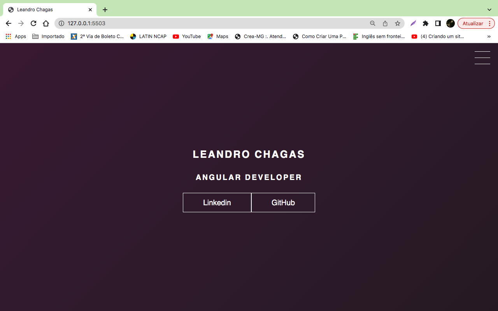

## Menu Hamburguer e Morphing Menu com CSS transitions

<p><Desafio de projeto referente ao bootcamp TQI Fullstack Developer. Trata-se do desenvolvimento de um portfólio utilizando apenas HTML e CSS./p>

## :globe_with_meridians: Tecnologias

Esse projeto foi desenvolvido usando as seguintes tecnologias:


 

## :wrench: Como Utilizar

Clone essa aplicação utilizando o [Git](https://git-scm.com) e utilizando os seguintes comandos:

```bash
# Clonando esse repositório
$ git clone https://github.com/chagasleandro/projeto-menu-hambuguer-dio
```
Em seguida execute o arquivo 'index.html' no seu navegador. </br>
<p>O perfil LinkedIn e GitHub pode ser acessado clicando nos dois botões na tela inicail do projeto, e também no meu tipo Hambuguer onde que clicando se mostra home, sobre e projetos no github. </p>


